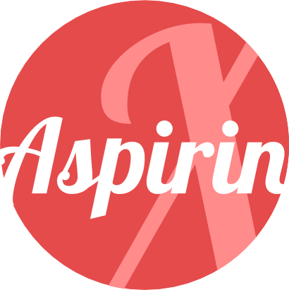
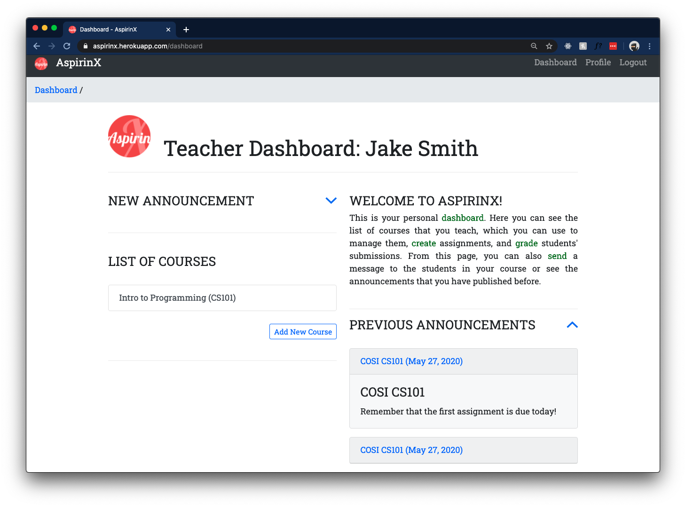
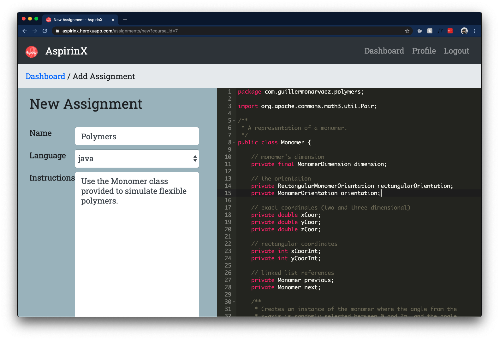
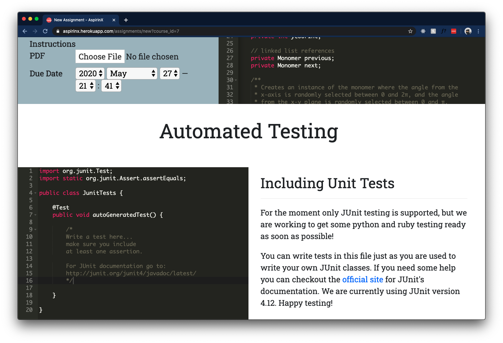

    
    <h3>Aspirin X</h3>

A web application written in Ruby on Rails that allows teachers to create, manage, and grade assignments. Students can use the portal to code and test their soulutions, while teachers can automate grading using unit testing.

## Assignment Creation

## Automated Testing

